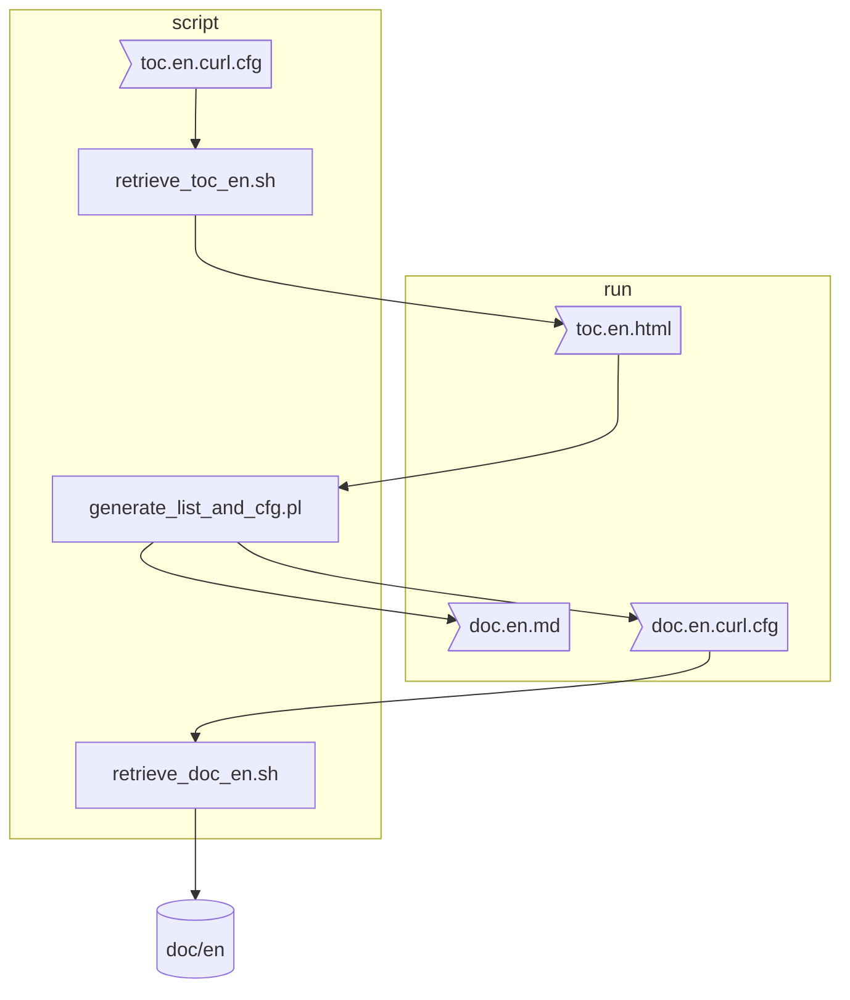

# `Script` and `Run` directory structure

```mermaid
graph TD;
  subgraph run
    o>toc.en.html];
    m>doc.en.md];
    c>doc.en.curl.cfg];
  end
  subgraph script
    a>toc.en.curl.cfg]-->A[retrieve_toc_en.sh];
    G[generate_list_and_cfg.pl];
    r[retrieve_doc_en.sh];
  end

A-->o
o-->G
G-->m
G-->c
c-->r
r-->doc[(doc/en)]
```
