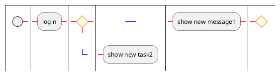
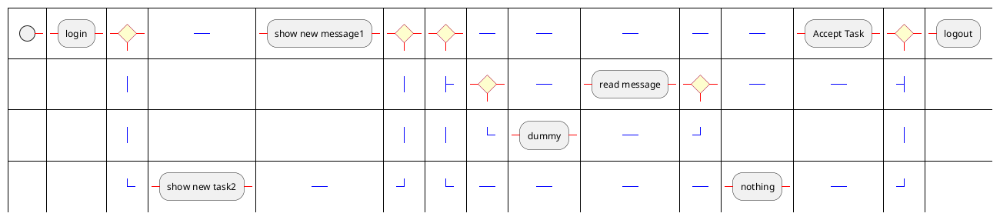

## Business Process Model and Notation (BPMN)

This is preliminary works to add [BPMN](https://en.wikipedia.org/wiki/Business_Process_Model_and_Notation) support in PlantUML.

Right now, some quick stuff have been done.

The implementation is based on ideas developped in:
* [kitzmann2009a.pdf](http://wiki.plantuml.net/_media/site/kitzmann2009a.pdf)
* [A Simple Algorithm for Automatic Layout of BPMN Processes](https://www.researchgate.net/publication/221542866_A_Simple_Algorithm_for_Automatic_Layout_of_BPMN_Processes)


*[Ref. [Wiki-BPMN](http://wiki.plantuml.net/site/bpmn)]*


## Final examples




*[Ref. [QA-5647](https://forum.plantuml.net/5647)]*



*[Ref. [Wiki-bpmn](http://wiki.plantuml.net/site/bpmn)]*


## Existing diagrams

Please put here pointer existing diagrams that you'd like to have supported in PlantUML.

[Basic processes with User Task, Service Task, Exclusive Gateways, and Parallel Gateways](https://www.tim-zoeller.de/Basics-1.png)

Start with simple examples!

This [PDF](http://www.bpmb.de/images/BPMN2_0_Poster_EN.pdf) gives a good overview of the BPMN2.0 syntax.
It basically boils down to boxes, circles and lines plus swimlanes.
So it is close to an activity diagram.

All shapes can be "decorated" with symbols.
These add some more detail, but are not necessary to get an overview of the process.
This fact should be reflected in the syntax - it should first let you design the process and then add the details.


## Syntax
The proposed syntax is probably not very clear.

Here we have to talk about it and propose a better one.

There are rules for good diagrams which might make the syntax easier to create.
One of these rules is that when you split the process- (token-) flow, it will be merged back together with the same symbol.
[comment: This is not neccessarily true. It is allowed to merge the flows with a different gateway, again or without any gateway at all. Also, the flows don't need to be merged]

There is also the feature of "closed" swim-lanes - swim-lanes where the content is not shown because the detailed process is not known or you want to focus on other parts of the diagram.
It should be reflected by the syntax that a swim-lane can be opened and closed with just a switch.


## Example1

```
@startbpm
XXXX
@endbpm
```


## Example2

```
@startbpm
XXXX
@endbpm
```


## Example3

```
@startbpm
XXXX
@endbpm
```


## Other theorical works

The following [BPMN Layouter project ](https://github.com/MarvinLudwig/bpmn_layouter) may be interesting.
[jjc-mt.pdf](jjc-mt.pdf)


