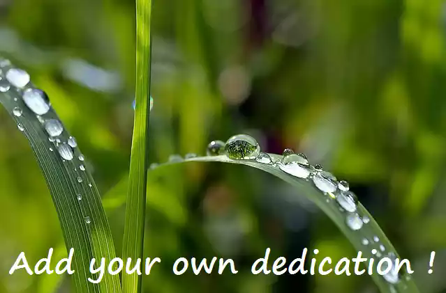

## Dedication

**You can integrate a personal photo or picture into PlantUML source code!**

The photo will be [encrypted into the source code](https://en.wikipedia.org/wiki/Stream_cipher), and will be displayed when a special sentence (*your dedication*) will be entered.

It could be a photo of your pet, someone you care about, some place you love... By this way, your photo will be algorithmically set in stone and spread all over the world, everywhere PlantUML is installed, even if no one but you knows about it...

There are two kinds of Dedication:

* *Public*: the special sentence is publicly written in the code of PlantUML, so someone searching into the code will be able to find it and then see your photo.
* *Private*: only [SHA-512 signature](https://en.wikipedia.org/wiki/SHA-2) of the special sentence is in the source code (as the encrypted photo). **No one can guess your special sentence, neither see your photo,** since it's encrypted using the sentence itself.

## Example

We have made a demo with the special sentence *Write your own dedication!*

It works in **each and every** deployed instance of PlantUML over the world !

## Why?

To support such a service, [we suggest a contribution](https://www.patreon.com/bePatron?patAmt=1&u=527450&rid=548118)
of **$5** per month.

**So why would people make dedication?**
* Because there might be some message that you want to be set in stone for eternity
* Because it's fun to be able to generate a beautiful image from a simple sentence
* Because it helps PlantUML to grow!

## How?

Just send [a mail to plantuml@gmail.com](mailto:plantuml@gmail.com?subject=Add%20my%20dedication) with
*"Add my dedication"* as subject and that lists:
* Your sentence,
* Your photo or picture,
* Whether you want a public or a private dedication.

We will build a beta version of PlantUML with your dedication and then:
* Send it to you,
* Install it [online on the PlantUML Web Server](http://plantuml.com/plantuml)
So that you can check the result.
**This is a free trial offer!**

*We hope that you will appreciate the result!*

