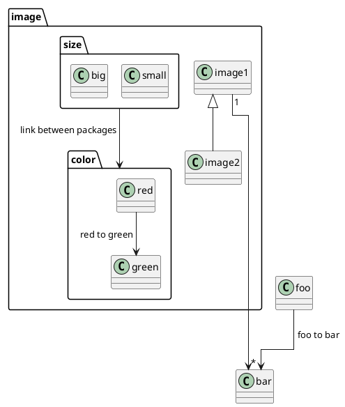

## Eclipse Layout Kernel

PlantUML uses an external layout engine for some diagrams (classes, use cases...). By default, GraphViz/dot is used. This means that PlantUML has to call an external process to generate some diagrams.

There are some work in progress to change this behavior. For example, [a port of GraphViz to Java](https://plantuml.com/smetana02) is ongoing.


Recently, [Hallvard Trætteberg](https://www.ntnu.edu/employees/hal) teaches us on how to use [Eclipse Layout Kernel](https://www.eclipse.org/elk/) as [a library to process the layout](https://github.com/plantuml/plantuml/issues/534).

This is still alpha-software, but results are very interesting. This is working starting from ``V1.2021.5``.


## Usage

ELK is distributed as an independent library. So you have to build it yourself, or you can download [the complete jar file here](http://beta.plantuml.net/elk-full.jar). 

Both ``plantuml.jar`` and ``elk-full.jar`` have to be in the very same folder. You cannot rename elk-full.jar

Once installed, you can invoke ELK instead of GraphViz with the ``!pragma layout elk`` directive.

**Example:**



This diagram is generated using ELK.

You can use the `-P` [command-line](command-line) option to specify the pragma, rather than putting it in the puml file:
```
java -jar plantuml.jar -Playout=elk
```
*[Ref. [issue-582](https://github.com/plantuml/plantuml/issues/582)]*

Do not expect too much right now, this is really an alpha-version. The idea is to get [feedback](https://forum.plantuml.net/13709/eclipse-layout-kernel) from users, to know if we should continue in this direction (that is, supporting ELK within PlantUML).

Still, you can test [class diagram](class-diagram) and [deployment diagram](deployment-diagram) and [tell us what you think about the result](https://forum.plantuml.net/13709/eclipse-layout-kernel).

See [smetana](smetana02) and [vizjs](vizjs) for other alternatives to [graphviz-dot](graphviz-dot).


