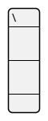

## JSON Diagram issues (json-issues)

This page lists issues on [JSON Diagram](json).

## JSON two-character escape sequence issues

[[#661111#FIXME]]
FIXME `\\n` and `\\` management in PlantUML 😉
*See [Report Bug on QA-13066](https://forum.plantuml.net/13066)*
[[#661111#FIXME]]

