## Format definition

```plantuml
@startuml
scale 0.75
left to right direction
frame "How is a PlantUML hyperlink?" #aliceblue {

rectangle rb [
<size:25><b>""[[""
]

frame "optional" as fu #palegreen {
frame u [
<i><b>URL
]
}

frame "optional" as ft #palegreen {
rectangle tb [
<size:25><b>""{""
]
frame t [
<i><b>a tooltip
]
rectangle te [
<size:25><b>""}""
]
}

frame "optional" as l #palegreen {
rectangle s [
<size:25><b>""␣""
]
frame ll [
<i><b>a label
]
}
rectangle  fe [
<size:25><b>""]]""
]
}
rb -- u
u -- tb
tb -- t
t -- te
te - s
ll -- fe
u -- s
s -- ll
u -- fe
te -- fe
@enduml
```




#### Simple link

Simple links are define using two square brackets (or three square brackets for field or method on class diagram).

__Example__:
* ``[[http://plantuml.com]]``
* ``[[]]`` *(empty link)*

#### Link with optional label

It is possible to give an optional label that will be printed instead of the link itself.
A space is used as separator after the URL itself.

__Example__:
``[[http://plantuml.com This label is printed]]``

#### Link with optional tooltip

Finally you can also have an optional tooltip using round brackets, just after the URL and before the optional label.

__Example__:
``[[http://plantuml.com{Optional tooltip} This label is printed]]``

#### Only tooltip
You can also have only a tooltip using round brackets.

__Example__:
``[[{A tooltip}]]``

#### Only tooltip and label
You can also have only a tooltip using round brackets, and a label.

__Example__:
``[[{A tooltip} This label is printed]]``

#### URL authentication

With [URL authentication](url-authentication) it is possible to provide an authentication method, credentials, and a proxy config to URL endpoints.


## Links contained curly bracket

A link can contain some curly brackets.


*[Ref. [QA-13489](https://forum.plantuml.net/13489/)]*


## Links in sequence diagram

The following example lists some links features:


## Links in class diagram


There is a special syntax with 3 square brackets in class definition when you want to define
a link on field or method.
For example:


## Links in activity diagram

### On activity label


### On partition

*[Ref. [QA-542](https://forum.plantuml.net/542/ability-to-define-hyperlink-on-diagram-elements?show=14003#c14003)]*


## Links in Network diagram (nwdiag)


## Links in JSON/YAML diagram 

### JSON


### YAML


## Links in notes

It is also possible to specify a link at the beginning of a note (the link applies to the full note), or inside a note (for a portion of the note). 


*[Ref. [Incubation: URL in diagrams](http://wiki.plantuml.net/site/incubation#url_in_diagrams)]*


## Links with explicit URL directive

You can use the `url of XXX is [[yyy]]` syntax:

### On sequence diagram


### On class diagram


### On usecase diagram


### On component or deployment diagram


*[Ref. [Incubation: URL in diagrams](http://wiki.plantuml.net/site/incubation#url_in_diagrams)]*


## Links in arrow (or Hyperlinks in link or connection)

### Class diagram


### Component or Deployment diagram

[[#FFD700#FIXME]] 🚩
See Wanted features [QA-6397](https://forum.plantuml.net/6397)
[[#FFD700#FIXME]]
```plantuml
@startuml
node Car 
Car *-- Wheel [[http://plantuml.com/deployment-diagram]] : has some
@enduml
```


*[Ref. [QA-6397](https://forum.plantuml.net/6397)]*


### State diagram

[[#FFD700#FIXME]] 🚩
Same Issue 
[[#FFD700#FIXME]]
```plantuml
@startuml
state Car
state CarWithWheel
Car -> CarWithWheel [[http://plantuml.com/state-diagram]] : Add wheel to car
@enduml
```


## Specific SkinParameter for Link

### hyperlinkColor 

You can change the ``color`` value of the links with the ``hyperlinkColor`` setting.


```plantuml
@startuml
skinparam hyperlinkColor red
:hyperlinkColor setting;
:[[http://plantuml.com]];
@enduml
```

*[Ref. [QA-2322](https://forum.plantuml.net/2322/increasing-visibility-of-links)]*

### hyperlinkUnderline 

You can underline or not the links with the ``hyperlinkUnderline`` setting.

```plantuml
@startuml
skinparam hyperlinkUnderline true
:hyperlinkColor setting;
:[[http://plantuml.com]];
@enduml
```
```plantuml
@startuml
skinparam hyperlinkUnderline false
:hyperlinkColor setting;
:[[http://plantuml.com]];
@enduml
```

🚩_'hyperlinkUnderline false' seems broken..._ 🏁

*[Ref. [QA-2866](https://forum.plantuml.net/2866/decreasing-visibility-of-links), [QA-15114](https://forum.plantuml.net/15114)]*


### topurl 

You can use `topurl` setting, in order to define the prefix for all the links on a PlantUML diagram, as:

```plantuml
@startmindmap

skinparam topurl https://plantuml.com/

* [[index PlantUML website]]
** [[sequence-diagram Sequence]]
** [[mindmap-diagram MindMap]]
** [[wbs-diagram WBS]]
** ...
@endmindmap
```

*[Ref. [QA-9016](https://forum.plantuml.net/9016/dashed-vs-solid-lines-in-sequence-diagrams?show=9023#c9023), [QA-13179](https://forum.plantuml.net/13179/how-the-skinparam-topurl-works-url-links) ]*

## Other SkinParameter for Link

You can see also on:
- [Specific SkinParameter for SVG](svg#34q86jw7xgn8k362kjon)


## Using (global) style

### Without style *(by default)*
```plantuml
@startuml
title test on HyperlinkColor [[test link]]

 class test <<normal>> {
  * aaa
  + [[normal model]]
  - bb
 }
 
  class test_with_stereo AS "[[http://www.plantuml.com test]]" <<red>> {
  * aaa
  + [[red model]]
  - bb
 }
@enduml
```


### With style

You can use [style](style-evolution) to change rendering of elements.

```plantuml
@startuml
<style>
.red {
  HyperlinkColor #FF0000
}
</style>

title test on HyperlinkColor [[test link]]

 class test <<normal>> {
  * aaa
  + [[normal model]]
  - bb
 }
 
  class test_with_stereo AS "[[http://www.plantuml.com test]]" <<red>> {
  * aaa
  + [[red model]]
  - bb
 }
@enduml
```

*[Ref. [QA-8071](https://forum.plantuml.net/8071/)]*


