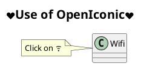

## OpenIconic

[OpenIconic](https://useiconic.com/open/) is an very nice open source icon set.
Those icons have been integrated into the [creole parser](creole), so you can use them out-of-the-box.

You can use the following syntax: ``<&ICON_NAME>``.

It also works with [salt, the graphical interface designer](salt).

```plantuml
@startsalt
{
  Login<&person> | "MyName   "
  Password<&key> | "****     "
  [Cancel <&circle-x>] | [OK <&account-login>]
}
@endsalt
```

The complete list is available on [OpenIconic Website](https://useiconic.com/open/), or
you can use the following special diagram:

