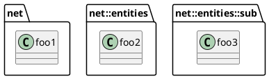
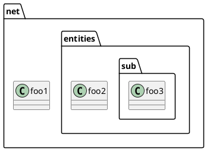
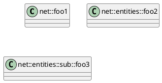
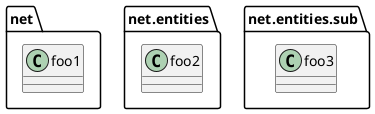
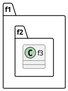

## Issue about Namespace and Package

Right now, the management of ``namespace`` and ``package`` may sound odd to users.

The real reason for this is some bad design decision made 10 years ago.

**So here is our new proposal:**

*Merge the notion of package or namespace in PlantUML so that package or namespace will be synonymous and behave as in all regular programming languages.*

* [Do not change anything](vote:no) and keep the actual behaviour of PlantUML.
* [Ok, implement this](vote:go) I understand that I *may* have to add ``set separator none`` to some old class diagrams to let them work as today.
* [Find another solution](vote:another) that won't break ascending compatibility.

You just have to click on one of the buttons to vote.

You have to add ``!pragma useNewPackage`` directive to your diagrams to activate the new package behaviour.

## Beta testing this new feature

The pool shows that the vast majority of users are welcoming this change.

Since this change may have some impact on existing diagrams, we are going to move slowly on this new feature.

Note that many diagrams are impacted by this changes:

* [class diagram](https://plantuml.com/class-diagram)
* [use case diagram](https://plantuml.com/use-case)
* [activity diagram](https://plantuml.com/activity-diagram-legacy)
* [component diagram](https://plantuml.com/component-diagram)
* [state diagram](https://plantuml.com/state-diagram)
* [deployment diagram](https://plantuml.com/deployment-diagram)

Other diagrams (including [sequence diagrams](https://plantuml.com/sequence-diagram) and [activity beta diagrams](https://plantuml.com/activity-diagram-beta)) are not impacted.

For starting, we need feedback from users to know if we still are on the right path.
So last beta [last beta plantuml.jar](http://beta.plantuml.net/plantuml.jar) and  [the online server](http://www.plantuml.com/plantuml/uml/SoWkIImgAStDuL8iA4fCpqrKA2rEzKij3qXCpavCJ-LApaaiBbR8IotHIyqhoIp9J2tMAovDqalBp-ToICrB0Me40000) provides now a convenient way for testing this feature. 

Those versions *temporary* implement both behaviours. You just have to add ``!pragma useNewPackage`` directive to activate the new package behaviour.

If you are already using PlantUML, it is very important that you test now this beta feature. Indeed, nothing has been definitively settled yet, [so feedback](http://alphadoc.plantuml.com/doc/dokuwiki/en/poll-about-package-and-namespace#2ou4k28pt3ukk5v9fq2d) will help us to find out any regressions.

This way, we will commit the right change for you. And when this beta feature will become the default behaviour, your diagrams will be safe.

## Proposition of new behaviour

You can use ``!pragma useNewPackage`` to enable the new behaviour.

By default, the double colon ``::`` will be interpreted by PlantUML as a separator.

Even if package are not explicitly nested, they will be printed as nested:

The following diagrams will give the same image:

or

Note that if you prefer, you could change ``package`` to ``namespace`` in those examples and you will get the same image.

## Separator change

Following first poll result, the double colon ``::`` is the default separator. You can still vote so that we decide to confirm this.

What should be the default value for ``set separator`` directive:

* [set separator none](vote:none) This will help compatibility with the legacy behaviour of PlantUML.
* [set separator .](vote:point) This is consistent with Java/C\#/C++ usage.
* [set separator ::](vote:doublecolon) This is consistent with UML standard, and will also help compatibility with legacy PlantUML
* [Another value](vote:other) You don't like the first choices.

As said, right now, in last beta, the double colon ``::`` is the default separator. But you can change it using ``set separator`` directive.

This separator feature would also be useful to retrieve the current behaviour, if **you don't** want the double colon ``::`` to be interpreted as a separator.

For example, you could have:

Here we fall back to the actual drawing of legacy PlantUML version.

Once again, you could change ``package`` to ``namespace`` in those examples and you will get the same images.

If using ``set separator none`` do not give you an acceptable result, [please contact us](http://alphadoc.plantuml.com/doc/dokuwiki/en/poll-about-package-and-namespace#2ou4k28pt3ukk5v9fq2d).

## Nested namespaces

Setting separator to ``none`` disable the merge of nested packages.
For example, compare :

and

## Feedback

If during your tests you find some issues:

* non-working diagram
* regression with ``set separator none`` on your diagram

please give us some feedback. You can either:

* Edit this part.
* Use the chat window.
* [Send us an email.](mailto:plantuml@gmail.com)
* [Post a message on the forum.](https://forum.plantuml.net/)

