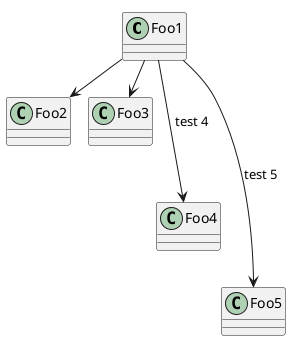

## Context of the Smetana project
PlantUML uses [Graphviz/DOT](graphviz-dot) to compute node positionning for some UML diagrams (only [usecase diagrams](use-case-diagram), [class diagrams](class-diagram), [object diagrams](object-diagram), [component diagrams](component-diagram), [deployment diagram](deployment-diagram), [state diagrams](state-diagram) and [Legacy activity diagrams](activity-diagram-legacy)).
The fact that DOT computes automatically the position of node is a key feature, and algorithms implemented in DOT usually give very good result.

However, there are some drawbacks of using DOT :
the computation is done by an external program (``dot.exe`` on Windows, ``dot`` on linux), and that means that :

*     PlantUML has to create a new process for each diagram, (and communication with this new process could be source of bugs).
*     Users have to install [DOT](graphviz-dot) on their system, in addition of Java.
*     PlantUML is not fully portable.

Another way of using DOT would be to use it as a library, and to link it with PlantUML using JNI
(Java Native Interface) but that would not be perfect thought.

If a Java version of Graphviz/DOT would exist, this would allow to greatly simplify the installation and the use of PlantUML.
So we have started a port from C to Java of GraphViz/DOT source code: see [Smetana project](https://github.com/plantuml/smetana)


## Using Smetana

Smetana code has been integrated into PlantUML, so you can use the ``!pragma layout smetana`` directive
to force PlantUML to use [Smetana](https://github.com/plantuml/smetana) (the internal Java port of GraphViz/Dot embedded in PlantUML sources) instead of the regular dot process.




**The key point is that this image has been generated without launching Graphviz/DOT!**

You can use the `-P` [command-line](command-line) option to specify the pragma, rather than putting it in the puml file:
```
java -jar plantuml.jar -Playout=smetana
```
*[Ref. [issue-582](https://github.com/plantuml/plantuml/issues/582)]*


See [elk](elk) and [vizjs](vizjs) for other alternatives to [graphviz-dot](graphviz-dot).


