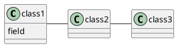

## XML Metadata Interchange (XMI)

> [The nice thing about standards is that there are so many of them to choose from.](http://www.quotationspage.com/quote/473.html) *Andrew S. Tanenbaum*

Many users ask for [XMI](http://en.wikipedia.org/wiki/XML_Metadata_Interchange)
support in PlantUML. So the ``-xmi`` flag has been added in the
command line (and in the ANT task also), for betatesting. This is only
working with class diagrams.

As explain on the [Modeling Portal](http://modeling-languages.com/), XMI [theoretically](http://modeling-languages.com/blog/content/xmi-nightmares-argouml-xmi-format-change)
allows to interchange data between programs.

So let's have a very simple example, with three classes:

Imagine that you can have a XMI file that can be imported successfully on
several UML tools. It would be nice.

Unfortunately, having the very same file is difficult. For
example,
* On [StarUML](http://staruml.sourceforge.net/en), you have to use [testStarUML.xml](http://plantuml.com/testStarUML.xml)
* On [ArgoUML](http://argouml.tigris.org), you have to use [testArgoUML.xml](http://plantuml.com/testArgoUML.xml)
If someone manages to have an identical file that would work on both
tools, please post it there : **you will have a free licence of PlantUML :-)**

So, they are actually 3 flags:
* `-xmi` : only classes are exported, without any relationship. This is very basic but should work with on many tools
* `-xmi:argo` : to be read by [ArgoUML](http://argouml.tigris.org)
* `-xmi:star` : to be read by [StarUML](http://staruml.sourceforge.net/en)
Please note that this is an alpha version, and that many things will probably not work. [You should use the forum to ask for corrections.](http://forum.plantuml.net/)

Update: now this feature is in production and is invoked as follows:
* `-txmi:argo` : to be read by [ArgoUML](http://argouml.tigris.org)
* `-txmi` or `-txmi:star` : to be read by [StarUML](http://staruml.sourceforge.net/en)

